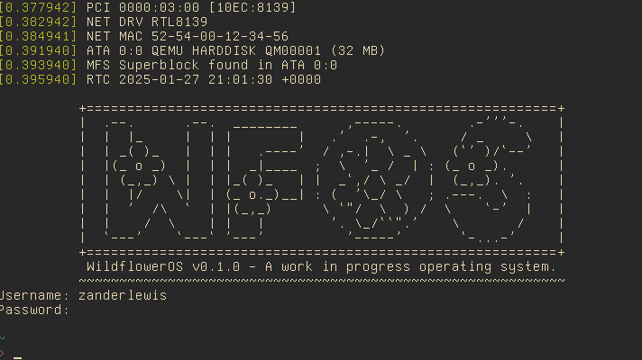

# WildflowerOS



WildflowerOS is a WIP fork of [MOROS](https://github.com/vinc/moros)

It targets computers with a x86-64 architecture and a BIOS, so mostly from 2005
to 2020, but it also runs well on most emulators (Bochs, QEMU, and VirtualBox).

## Running
```sh
cargo install bootimage # If you haven't already
make all
install # Do this once the emulator is running
# Choose /dev/ata/0/0 as the disk
```
